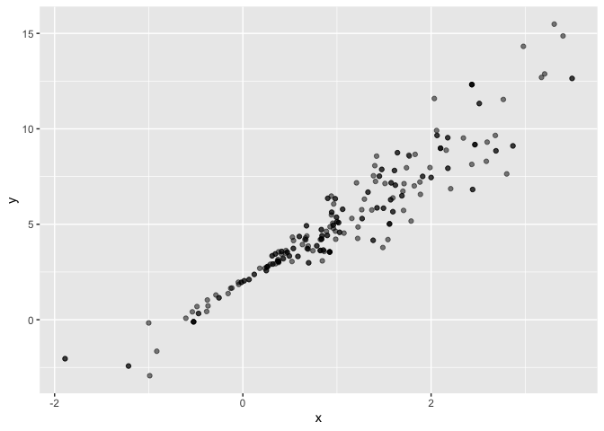

Bootstrapping
================
November 14, 2019

## Bootstraping in SLR

``` r
n_samp = 250

sim_df_const = 
  tibble(
    x = rnorm(n_samp, 1, 1),
    error = rnorm(n_samp, 0, 1),
    y = 2 + 3 * x + error
  )

sim_df_nonconst = sim_df_const %>% 
  mutate(
  error = error * .75 * x,
  y = 2 + 3 * x + error
)
```

``` r
sim_df = 
  bind_rows(const = sim_df_const, nonconst = sim_df_nonconst, .id = "data_source") 

sim_df %>% 
  ggplot(aes(x = x, y = y)) + 
  geom_point(alpha = .5) +
  stat_smooth(method = "lm") +
  facet_grid(~data_source) 
```

<!-- -->

Fit two models…

``` r
sim_df_const %>%
  lm(y ~x, data = .) %>%
  broom::tidy()
```

    ## # A tibble: 2 x 5
    ##   term        estimate std.error statistic   p.value
    ##   <chr>          <dbl>     <dbl>     <dbl>     <dbl>
    ## 1 (Intercept)     1.98    0.0981      20.2 3.65e- 54
    ## 2 x               3.04    0.0699      43.5 3.84e-118

``` r
sim_df_nonconst %>%
  lm(y ~x, data = .)  %>%
  broom::tidy()
```

    ## # A tibble: 2 x 5
    ##   term        estimate std.error statistic   p.value
    ##   <chr>          <dbl>     <dbl>     <dbl>     <dbl>
    ## 1 (Intercept)     1.93    0.105       18.5 1.88e- 48
    ## 2 x               3.11    0.0747      41.7 5.76e-114

## Drawing one bootstrap sample

Write a function to draw a boostrap sample based on a dataframe

``` r
sim_df_nonconst %>%
  sample_frac(size = 1, replace = TRUE) %>%
  arrange(x)
```

    ## # A tibble: 250 x 3
    ##         x  error       y
    ##     <dbl>  <dbl>   <dbl>
    ##  1 -1.89   1.62  -2.04  
    ##  2 -1.29   1.40  -0.454 
    ##  3 -0.989 -1.97  -2.93  
    ##  4 -0.989 -1.97  -2.93  
    ##  5 -0.914 -0.908 -1.65  
    ##  6 -0.914 -0.908 -1.65  
    ##  7 -0.914 -0.908 -1.65  
    ##  8 -0.733  0.447  0.248 
    ##  9 -0.733  0.447  0.248 
    ## 10 -0.606 -0.106  0.0774
    ## # … with 240 more rows

``` r
boot_sample = function(df) {
  sample_frac(df, size = 1, replace = TRUE)
}
```

``` r
boot_sample(sim_df_nonconst) %>%
  ggplot(aes(x = x, y = y)) +
  geom_point(alpha = .5)
```

<!-- -->

Organize a dataframe

``` r
boot_straps = 
  tibble(
    strap_num = 1:1000, 
    strap_sample = rerun(1000, boot_sample(df = sim_df_nonconst))
  )
```

Do some kind of analysis…

``` r
bootstrap_results = 
  boot_straps %>%
  mutate(
    models = map(strap_sample, ~lm(y ~x, data = .x)), 
    results = map(models, broom::tidy)
  ) %>%
  select(-strap_sample, -models) %>%
  unnest(results)
```

Summarize these results

``` r
bootstrap_results %>%
  group_by(term) %>%
  summarize(se = sd(estimate))
```

    ## # A tibble: 2 x 2
    ##   term            se
    ##   <chr>        <dbl>
    ## 1 (Intercept) 0.0748
    ## 2 x           0.101

## Try the modelr package

``` r
boot_straps = 
  sim_df_nonconst %>%
  modelr::bootstrap(1000)
```

Copy and paste from website

``` r
sim_df_nonconst %>% 
  modelr::bootstrap(n = 1000) %>% 
  mutate(
    models = map(strap, ~lm(y ~ x, data = .x) ),
    results = map(models, broom::tidy)) %>% 
  select(-strap, -models) %>% 
  unnest(results) %>% 
  group_by(term) %>% 
  summarize(boot_se = sd(estimate))
```

    ## # A tibble: 2 x 2
    ##   term        boot_se
    ##   <chr>         <dbl>
    ## 1 (Intercept)  0.0793
    ## 2 x            0.104

## What is your assumptions aren’t wrong?

``` r
sim_df_const %>%
  lm(y ~x, data = .) %>%
  broom::tidy()
```

    ## # A tibble: 2 x 5
    ##   term        estimate std.error statistic   p.value
    ##   <chr>          <dbl>     <dbl>     <dbl>     <dbl>
    ## 1 (Intercept)     1.98    0.0981      20.2 3.65e- 54
    ## 2 x               3.04    0.0699      43.5 3.84e-118

``` r
sim_df_const %>% 
  modelr::bootstrap(n = 1000) %>% 
  mutate(
    models = map(strap, ~lm(y ~ x, data = .x) ),
    results = map(models, broom::tidy)) %>% 
  select(-strap, -models) %>% 
  unnest(results) %>% 
  group_by(term) %>% 
  summarize(boot_se = sd(estimate))
```

    ## # A tibble: 2 x 2
    ##   term        boot_se
    ##   <chr>         <dbl>
    ## 1 (Intercept)  0.101 
    ## 2 x            0.0735

## Using airbnb data

``` r
data("nyc_airbnb")

nyc_airbnb = 
  nyc_airbnb %>% 
  mutate(stars = review_scores_location / 2) %>% 
  rename(
    boro = neighbourhood_group,
    neighborhood = neighbourhood) %>% 
  filter(boro != "Staten Island") %>% 
  select(price, stars, boro, neighborhood, room_type)
```
