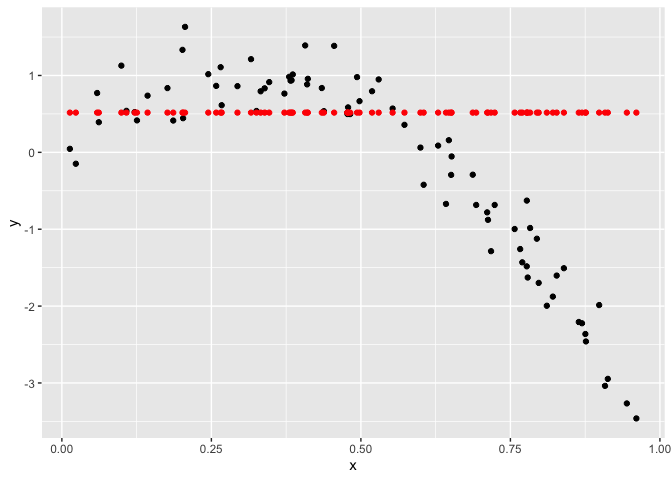
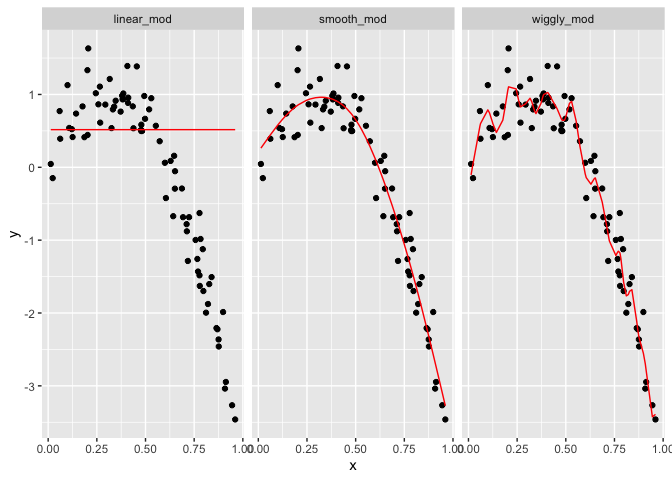

Cross Validation
================
November 12, 2019

## Cross validation

``` r
nonlin_df = 
  tibble(
    id = 1:100,
    x = runif(100, 0, 1),
    y = 1 - 10 * (x - .3) ^ 2 + rnorm(100, 0, .3)
  )

nonlin_df %>% 
  ggplot(aes(x = x, y = y)) + 
  geom_point() + theme_bw()
```

<!-- -->

Training and testing

Cross validation by hand

``` r
train_df = sample_frac(nonlin_df, size = .8)
test_df = anti_join(nonlin_df, train_df, by = "id")

ggplot(train_df, aes(x = x, y = y)) + 
  geom_point() + 
  geom_point(data = test_df, color = "red")
```

<!-- -->

Fit three models of varying goodness:

  - Linear regression, which generally doesn’t work as well

  - Smooth curve

  - Wiggly
    model

<!-- end list -->

``` r
linear_mod = lm(x ~ x, data = train_df)
```

    ## Warning in model.matrix.default(mt, mf, contrasts): the response appeared
    ## on the right-hand side and was dropped

    ## Warning in model.matrix.default(mt, mf, contrasts): problem with term 1 in
    ## model.matrix: no columns are assigned

``` r
smooth_mod = mgcv::gam(y ~ s(x), data = train_df)
wiggly_mod = mgcv::gam(y ~ s(x, k = 30), sp = 10e-6, data = train_df)
```

Let’s look at some fits.

``` r
train_df %>%
  add_predictions(linear_mod) %>%
  ggplot(aes(x = x, y = y)) +
  geom_point() +
  geom_point(aes(y = pred), color = "red")
```

<!-- -->

``` r
train_df %>%
  add_predictions(smooth_mod) %>%
  ggplot(aes(x = x, y = y)) +
  geom_point() +
  geom_line(aes(y = pred), color = "red")
```

<!-- -->

``` r
train_df %>%
  add_predictions(wiggly_mod) %>%
  ggplot(aes(x = x, y = y)) +
  geom_point() +
  geom_line(aes(y = pred), color = "red")
```

<!-- -->

``` r
train_df %>% 
  gather_predictions(linear_mod, smooth_mod, wiggly_mod) %>% 
  mutate(model = fct_inorder(model)) %>% 
  
  ggplot(aes(x = x, y = y)) + 
  geom_point() + 
  geom_line(aes(y = pred), color = "red") + 
  facet_wrap(~model)
```

<!-- -->

Calculate root mean square error where larger values are worse

``` r
rmse(linear_mod, test_df)
```

    ## [1] 0.2805514

``` r
rmse(smooth_mod, test_df)
```

    ## [1] 0.2221774

``` r
rmse(wiggly_mod, test_df)
```

    ## [1] 0.289051

We are interested in the model that will do better on the test dataset.
The training dataset is the one where you put in too much stuff. Putting
more stuff into the training dataset makes the rmse decrease.

## Do this all using modelr

crossv\_mc generates test-training pairs for cross-validation

``` r
cv_df = 
  crossv_mc(nonlin_df, 100) 
```
